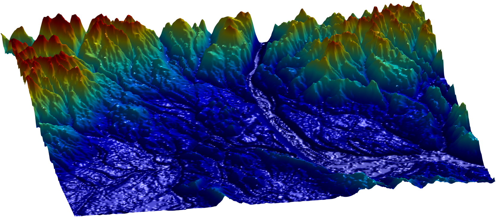

# Table of contents

* [Abstract](#abstract)
* [Field Experiment](#field_experiment)
* [Simulated Experiment](#simulated_experiments)
  * [Environment N17E073](#N17E073)
  * [Environment N43W080](#N43W080)
  * [Environment N45W123](#N45W123)
  * [Environment N47W124](#N47W124)

# Abstract
Robotic Information Gathering (RIG) relies on the uncertainty of a probabilistic model to identify critical areas for efficient data collection. Gaussian processes (GPs) with stationary kernels have been widely adopted for spatial modeling. However, real-world spatial data typically does not satisfy the assumption of stationarity, where different locations are assumed to have the same degree of variability. As a result, the prediction uncertainty does not accurately capture prediction error, limiting the success of RIG algorithms. We propose a novel family of nonstationary kernels, named the Attentive Kernel (AK), which is simple, robust, and can extend any existing kernel to a nonstationary one. We evaluate the new kernel in elevation mapping tasks, where AK provides better accuracy and uncertainty quantification over the commonly used RBF kernel and other popular nonstationary kernels. The improved uncertainty quantification guides the downstream RIG planner to collect more valuable data around the high-error area, further increasing prediction accuracy. A field experiment demonstrates that the proposed method can guide an Autonomous Surface Vehicle (ASV) to prioritize data collection in locations with high spatial variations, enabling the model to characterize the salient environmental features.

---

# Field Experiment


---

# Simulated Experiments

## Environment: N17E073

Attentive Kernel | RBF Kernel
:-------------------------:|:-------------------------:|
  |  

Gibbs Kernel | Deep Kernel Learning
:-------------------------:|:-------------------------:|
  |  

---

## Environment: N43W080

Attentive Kernel | RBF Kernel
:-------------------------:|:-------------------------:|
  |  

Gibbs Kernel | Deep Kernel Learning
:-------------------------:|:-------------------------:|
  |  

---

## Environment: N45W123

Attentive Kernel | RBF Kernel
:-------------------------:|:-------------------------:|
  |  

Gibbs Kernel | Deep Kernel Learning
:-------------------------:|:-------------------------:|
  |  

---

## Environment: N47W124

Attentive Kernel | RBF Kernel
:-------------------------:|:-------------------------:|
  |  

Gibbs Kernel | Deep Kernel Learning
:-------------------------:|:-------------------------:|
  |  

---
